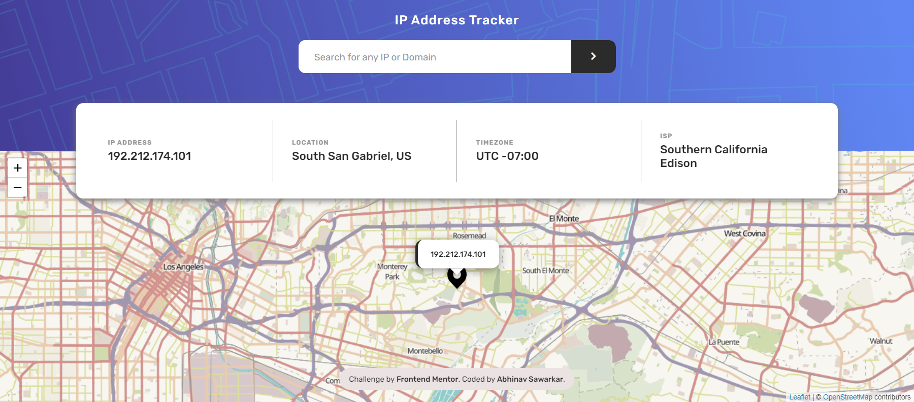
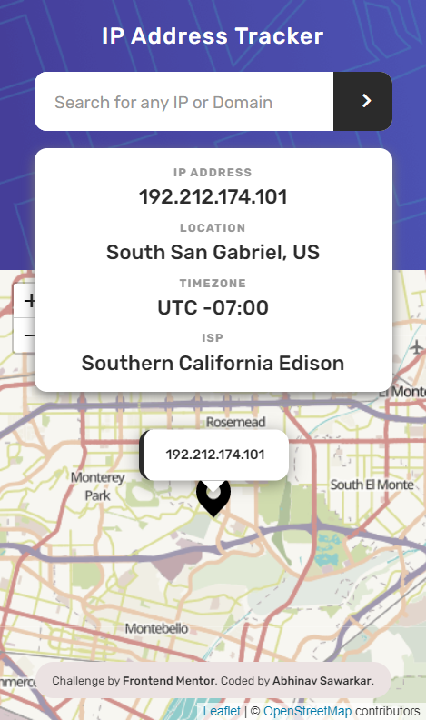

# Frontend Mentor - IP address tracker solution

## Table of contents

- [Overview](#overview)
  - [Screenshot](#screenshot)
  - [Links](#links) -[Built with](#built_with)
- [Author](#author)

## Overview

### The challenge

Users should be able to:

- View the optimal layout for each page depending on their device's screen size
- See hover states for all interactive elements on the page
- Search for any IP addresses or domains and see the key information and location

### Screenshot

### Links

- Solution URL: [github url](https://github.com/abhinavishere/ip-address-tracker)

### Built with

- Semantic HTML5 markup
- CSS custom properties
- Flexbox
- CSS Grid
- Mobile-first workflow
- Leaflet.js Library for rendering maps
- IP Geolocation API for IP Address tracking

## Author

- Twitter - [@probablyabhinav](https://www.twitter.com/probablyabhinav)
